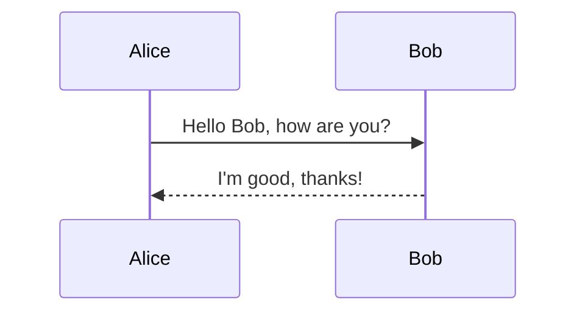

# Markdown 语法完全指南

## 1. 标题 (Headings)

### 1.1 Setext 风格 (一级和二级)
```markdown
一级标题
=========

二级标题
---------
```

### 1.2 ATX 风格 (1-6级)
```markdown
# 一级标题
## 二级标题
### 三级标题
#### 四级标题
##### 五级标题
###### 六级标题
```

### 1.3 可选闭合符号
```markdown
# 一级标题 #
## 二级标题 ##
```

## 2. 段落和换行

### 2.1 段落
```markdown
这是第一个段落。

这是第二个段落，中间有空行分隔。
```

### 2.2 硬换行 (两个空格结尾)
```markdown
这是第一行（后面有两个空格）  
这是第二行
```

### 2.3 软换行 (直接回车)
```markdown
这是第一行
这是第二行（在某些渲染器中会合并）
```

## 3. 文本格式

### 3.1 强调
```markdown
*斜体文本* 或 _斜体文本_
**粗体文本** 或 __粗体文本__
***粗斜体*** 或 ___粗斜体___
```

### 3.2 删除线
```markdown
~~删除线文本~~
```

### 3.3 高亮 (扩展语法)
```markdown
==高亮文本==
```

### 3.4 下标和上标
```markdown
H~2~O  (下标)
x^2^   (上标)
```

## 4. 列表

### 4.1 无序列表
```markdown
- 项目1
- 项目2
  - 子项目2.1
  - 子项目2.2
    - 子子项目
* 另一种符号
+ 第三种符号
```

### 4.2 有序列表
```markdown
1. 第一项
2. 第二项
3. 第三项
```

### 4.3 任务列表
```markdown
- [x] 已完成任务
- [ ] 未完成任务
- [ ] 另一个任务
```

### 4.4 定义列表 (扩展语法)
```markdown
术语1
: 定义1

术语2
: 定义2
  多行定义
```

## 5. 链接

### 5.1 行内链接
```markdown
[链接文本](https://example.com "可选标题")
```

### 5.2 引用式链接
```markdown
[链接文本][1]
[另一个链接][2]

[1]: https://example.com "示例网站"
[2]: https://example.org
```

### 5.3 自动链接
```markdown
<https://example.com>
<email@example.com>
```

## 6. 图片

### 6.1 基本语法
```markdown

```

### 6.2 引用式图片
```markdown
![替代文本][logo]

[logo]: /path/to/logo.png "Logo标题"
```

## 7. 代码

### 7.1 行内代码
```markdown
使用 `console.log()` 函数输出内容。
```

### 7.2 代码块
````markdown
```javascript
function hello() {
  console.log("Hello, World!");
}
```
````

### 7.3 缩进代码块 (4个空格或1个制表符)
```markdown
    这是代码块
    第二行代码
```

### 7.4 语法高亮支持的语言
- `javascript` 或 `js`
- `python` 或 `py`
- `html`
- `css`
- `java`
- `bash` 或 `sh`
- `sql`
- 等等...

## 8. 引用 (Blockquotes)

### 8.1 基本引用
```markdown
> 这是一个引用
> 可以跨越多行
>
> 空行分隔的引用段落
```

### 8.2 嵌套引用
```markdown
> 第一层引用
> > 第二层引用
> > > 第三层引用
```

### 8.3 引用中包含其他元素
```markdown
> ## 引用中的标题
> 
> - 引用中的列表
> - 另一个列表项
> 
> `引用中的代码`
```

## 9. 表格

### 9.1 基本表格
```markdown
| 列1 | 列2 | 列3 |
|-----|-----|-----|
| 数据1 | 数据2 | 数据3 |
| 数据4 | 数据5 | 数据6 |
```

### 9.2 对齐方式
```markdown
| 左对齐 | 居中对齐 | 右对齐 |
|:-------|:--------:|-------:|
| 数据左 | 数据中   | 数据右 |
```

### 9.3 复杂表格 (扩展语法)
```markdown
| 功能 | 语法 | 示例 |
|------|------|------|
| 粗体 | `**文本**` | **粗体** |
| 斜体 | `*文本*` | *斜体* |
```

## 10. 水平分割线

```markdown
---
***
___
* * *
- - -
```

## 11. HTML 支持

### 11.1 内嵌 HTML
```markdown
<div style="color: blue; font-size: 20px;">
  这是蓝色的大文本
</div>

<span style="background-color: yellow;">高亮文本</span>
```

### 11.2 HTML 实体
```markdown
& < > " ' &copy; &reg;
```

## 12. 转义字符

```markdown
\* 转义星号
\# 转义井号
\[ 转义左方括号
\] 转义右方括号
\( 转义左括号
\) 转义右括号
\_ 转义下划线
\{ 转义左花括号
\} 转义右花括号
\+ 转义加号
\- 转义减号
\. 转义点号
\! 转义感叹号
\` 转义反引号
\| 转义竖线
```

## 13. 脚注

```markdown
这是主要文本[^1]，包含一个脚注。

[^1]: 这是脚注的内容，可以出现在文档的任何位置。
```

## 14. 目录 (TOC) - 扩展语法

```markdown
[TOC]

# 标题1
## 子标题1.1
## 子标题1.2
# 标题2
```

## 15. 数学公式 (扩展语法)

### 15.1 行内公式
```markdown
这是行内公式 $E = mc^2$ 的例子。
```

### 15.2 块级公式
```markdown
$$
\int_{-\infty}^{\infty} e^{-x^2} dx = \sqrt{\pi}
$$
```

## 16. 图表支持 (扩展语法)

### 16.1 Mermaid 流程图
````markdown

````

### 16.2 序列图
````markdown

````

## 17. 元数据 (Front Matter)

### 17.1 YAML 格式
```markdown
---
title: 文档标题
author: 作者名
date: 2024-01-01
tags: [标签1, 标签2, 标签3]
---
```

### 17.2 TOML 格式
```markdown
+++
title = "文档标题"
author = "作者名"
date = 2024-01-01
tags = ["标签1", "标签2", "标签3"]
+++
```

### 17.3 JSON 格式
```markdown
{
  "title": "文档标题",
  "author": "作者名",
  "date": "2024-01-01",
  "tags": ["标签1", "标签2", "标签3"]
}
```

## 18. 注释

```markdown
[//]: # (这是注释，不会显示在渲染结果中)
<!-- 这也是注释 -->
```

## 19. 特殊功能

### 19.1 嵌入视频
```markdown

```

### 19.2 嵌入音频
```markdown

```

## 20. 最佳实践

1. **一致性**: 在整个文档中使用一致的格式
2. **可读性**: 在源代码中保持良好的可读性
3. **兼容性**: 考虑目标平台的Markdown支持程度
4. **备份**: 重要的格式化内容考虑使用HTML备用

## 21. 工具推荐

- **编辑器**: VS Code, Typora, Obsidian
- **在线工具**: StackEdit, Dillinger
- **预览工具**: Markdown Preview Enhanced
- **转换工具**: Pandoc (Markdown to PDF/HTML/etc)

---

**注意**: 不同Markdown渲染器（GitHub, GitLab, VS Code, 各种博客平台等）可能支持不同的扩展语法，请根据实际使用环境进行调整。

**参考标准**: [CommonMark](https://commonmark.org/) | [GitHub Flavored Markdown](https://github.github.com/gfm/)